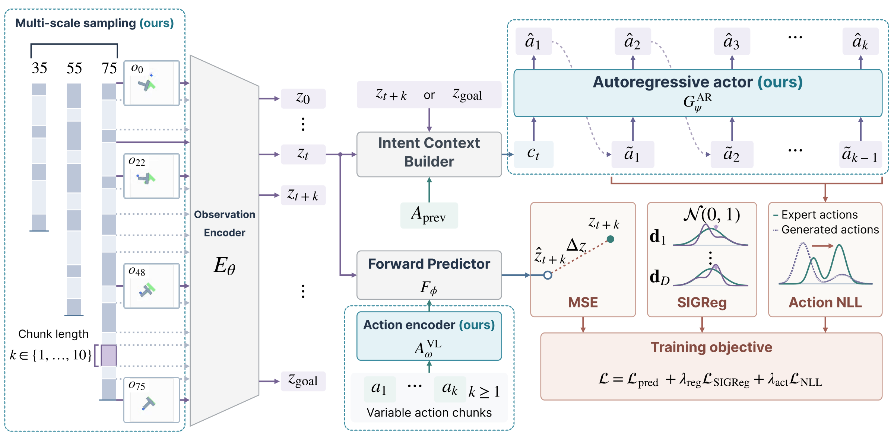
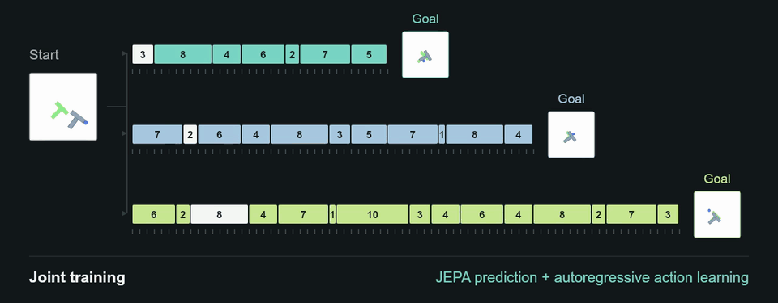
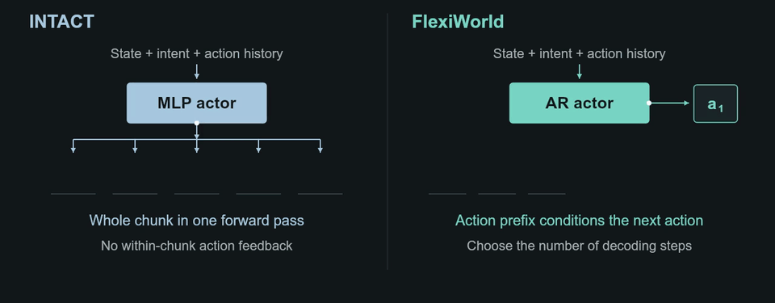
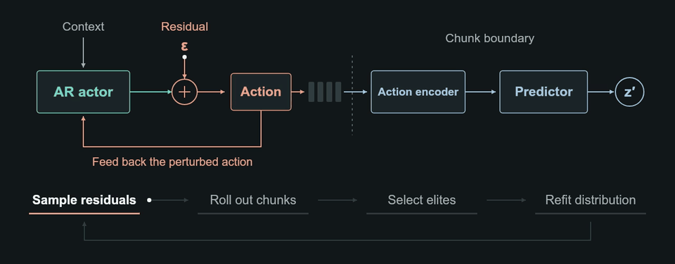
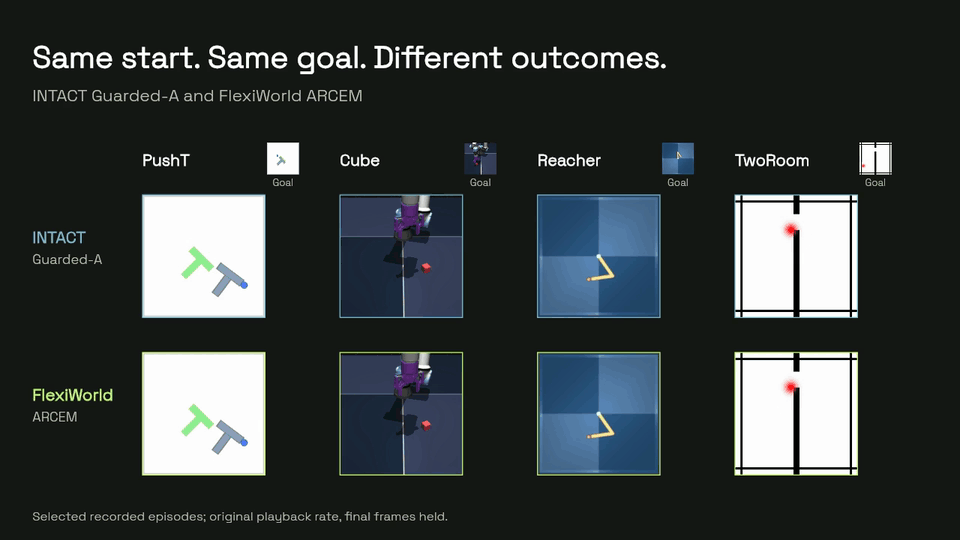
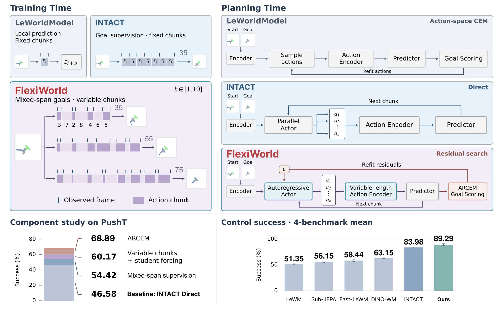

<div align="center">

<p>
  
</p>

# FlexiWorld: Learning and Planning via Flexible Action Chunks Across Multiple Time Scales

A JEPA-based world model for goal-directed control with flexible action chunks and autoregressive residual search.

[Shidu Ren](https://openreview.net/profile?id=~Shidu_Ren1)<sup>1*</sup>,
[Qilin Gu](https://openreview.net/profile?id=~Qilin_Gu2)<sup>1*</sup>,
[Zhenghao Ni](https://openreview.net/profile?id=~Zhenghao_Ni1)<sup>1*</sup>,
[Junhan Sun](https://openreview.net/profile?id=~Junhan_Sun1)<sup>4</sup>,
[Jiaqi Wang](https://openreview.net/profile?id=~Jiaqi_Wang8)<sup>5</sup>,
[Damien Scieur](https://openreview.net/profile?id=~Damien_Scieur3)<sup>3,6</sup>,
[Yunze Liu](https://openreview.net/profile?id=~Yunze_Liu2)<sup>2&dagger;</sup>

<sup>1</sup>University of Toronto &nbsp; <sup>2</sup>Tsinghua University &nbsp; <sup>3</sup>Mila & Universit&eacute; de Montr&eacute;al<br>
<sup>4</sup>Zhejiang University &nbsp; <sup>5</sup>Tencent Jarvis Lab &nbsp; <sup>6</sup>Samsung SAIL

<sup>*</sup>Equal Contribution &nbsp; <sup>&dagger;</sup>Corresponding Author

[](https://arxiv.org/abs/2609.35138)
[](https://shidu-ren.github.io/FlexiWorld-Project-Page/)
[](https://huggingface.co/ryanren0330/FlexiWorld)
[](LICENSE)

**[Overview](#overview) &nbsp; / &nbsp; [Method](#method) &nbsp; / &nbsp; [Demo](#demo) &nbsp; / &nbsp; [Installation](#installation) &nbsp; / &nbsp; [Models](#pretrained-models) &nbsp; / &nbsp; [Training](docs/TRAINING.md) &nbsp; / &nbsp; [Evaluation](docs/EVALUATION.md) &nbsp; / &nbsp; [Citation](#citation)**

</div>

---

## Overview

<a href="assets/teaser-reveal.mp4"></a>

FlexiWorld learns a latent world model with **mixed-span goal supervision**, a causal action encoder, and an autoregressive actor over **variable-length action chunks**. The same model supports search-free **Direct** control and **ARCEM**, action-residual search with feedback within each chunk.

## Method

### Architecture



**Figure 2.** Joint world-model prediction and autoregressive action learning.

### Mixed-span Learning

<a href="assets/mixed-span.mp4"></a>

Mixed goal spans and variable-length chunks jointly train the JEPA world model and actor.

### Autoregressive Actor

<a href="assets/ar-actor.mp4"></a>

Both methods predict states between chunks; unlike [INTACT's parallel chunk output](https://github.com/zju3dv/INTACT-JEPA/blob/main/module.py), FlexiWorld also feeds generated actions back within each chunk.

### ARCEM

<a href="assets/arcem.mp4"></a>

ARCEM searches action residuals with within-chunk feedback and latent prediction at chunk boundaries.

## Pretrained Models

The model package contains one checkpoint per benchmark, all with **training seed 3072**. Every checkpoint supports both Direct and ARCEM.

| Benchmark | Checkpoint directory | Planners |
|:--|:--|:--|
| PushT | `pusht/seed3072` | Direct, ARCEM |
| Cube | `cube/seed3072` | Direct, ARCEM |
| Reacher | `reacher/seed3072` | Direct, ARCEM |
| TwoRoom | `tworoom/seed3072` | Direct, ARCEM |

After installation and data preparation, download from the [model repository](https://huggingface.co/ryanren0330/FlexiWorld) and run ARCEM:

```bash
hf download ryanren0330/FlexiWorld --local-dir checkpoints
python src/eval.py --task pusht --checkpoint checkpoints/pusht/seed3072 \
  --planner arcem --cache-dir ./data_cache
```

Each checkpoint includes `weights.pt`, `config.json`, `model.yaml`, and task/seed metadata in `train_config.yaml`. File checksums are provided in `SHA256SUMS`.

## Installation

Use Linux, Python 3.12, and a compatible CUDA driver. Default training uses two NVIDIA GPUs; environment evaluation uses one.

```bash
git clone https://github.com/Shidu-Ren/FlexiWorld.git
cd FlexiWorld
python3.12 -m venv .venv
source .venv/bin/activate
pip install -r requirements-env.txt
pip install pytest
python -m pytest -q
```

Training and the planners use PyTorch 2.7.1. The test suite runs on CPU with synthetic data. Check the official PyTorch installation instructions if your CUDA driver needs a different wheel index.

## Data

Download and extract the benchmark datasets from the [LeWM collection](https://huggingface.co/collections/quentinll/lewm). Following [LeWM](https://github.com/lucas-maes/le-wm/blob/main/train.py), dataset windows are randomly split into 90% training and 10% validation using the training seed.

```text
data_cache/datasets/
  pusht_expert_train.h5
  pusht_expert_train.lance/
  ogbench/cube_single_expert.h5
  dmc/reacher_random.h5
  tworoom.h5
```

PushT training uses Lance, and evaluation uses HDF5. Prepare the training data:

```bash
python src/prepare_data.py --cache-dir ./data_cache
export SWM_DATA_DIR="$PWD/data_cache"
```

The preparation script converts HDF5 to Lance and validates episode layout and action rows. See the [training protocol](docs/PROTOCOL.md#training-data) for data preparation and sampling details.

## Training

Train from scratch on two GPUs with batch size 128 per GPU (global batch 256), goal spans 35/55/75, chunk lengths 1--10, Student Forcing probability 0.5, and two mixed-span epochs:

```bash
python src/train.py task=pusht seed=0
python src/train.py task=cube seed=0
python src/train.py task=reacher seed=0
python src/train.py task=tworoom seed=0
```

Each command trains one task with the chosen seed; change `seed=0` to any desired training seed. The paper uses `0`, `42`, and `3072`. Each checkpoint directory contains `weights.pt`, `model.yaml`, `train_config.yaml`, and a hashed `split_manifest.json`:

```text
outputs/<task>/seed<seed>/
```

See the [training guide](docs/TRAINING.md) for DDP settings, configuration files, and checkpoint outputs.

## Main Evaluation

Choose one checkpoint and either `direct` or `arcem`. Each command evaluates **seeds 0, 1, and 42** at goal distances **25, 50, 75, and 100**, with 100 episodes per seed and distance:

```bash
python src/eval.py --task pusht --checkpoint outputs/pusht/seed0 \
  --planner direct --cache-dir ./data_cache

python src/eval.py --task pusht --checkpoint outputs/pusht/seed0 \
  --planner arcem --cache-dir ./data_cache
```

Replace `pusht` and the checkpoint path for another benchmark. Results and a summary are saved under `results/<task>_s<training-seed>_<planner>/`. The summary reports mean success rates and SD across evaluation seeds for the selected checkpoint. See the [evaluation guide](docs/EVALUATION.md) for planner settings, distance selection, and output details.

## Reported Results

The following are the **paper's reported main results**. Success rates are averaged over four distances and three evaluation seeds; SD is across three training seeds.

| Planner | PushT | Cube | Reacher | TwoRoom | Average |
|:--|--:|--:|--:|--:|--:|
| Direct | 60.39 +/- 3.92 | 91.36 +/- 1.56 | 99.06 +/- 0.05 | 96.36 +/- 1.92 | 86.79 +/- 1.65 |
| ARCEM | 68.89 +/- 4.80 | 91.94 +/- 1.50 | 99.72 +/- 0.17 | 96.61 +/- 2.45 | 89.29 +/- 1.96 |

See the [project page](https://shidu-ren.github.io/FlexiWorld-Project-Page/) for paired control demos.

## Code Organization

The official PyTorch implementation provides training and both main planners for **PushT, Cube, Reacher, and TwoRoom**.

| Component | Contents | Guide |
|:--|:--|:--|
| [`src/train.py`](src/train.py) | Full-method training | [Training guide](docs/TRAINING.md) |
| [`src/eval.py`](src/eval.py) | Single-checkpoint Direct/ARCEM evaluation | [Evaluation guide](docs/EVALUATION.md) |
| [`src/flexiworld/`](src/flexiworld/) | Shared models, data loaders, and planners | [Code organization](#code-organization) |
| [`src/configs/`](src/configs/) | Training and benchmark configurations | [Protocol](docs/PROTOCOL.md) |

```text
FlexiWorld/
  src/
    train.py               # Training entry point
    train_step.py          # Joint training objective
    eval.py                # Evaluation and result aggregation
    prepare_data.py        # PushT data preparation
    configs/
      train/               # Training and model configuration
      eval/                # Four benchmark configurations
    flexiworld/
      models/              # World model, action encoder, autoregressive actor
      planning/            # Direct, ARCEM, and action history
      data/                # Trajectory datasets, windows, and batching
  assets/                  # Paper figures and animated method / control demo
  docs/                    # Protocol and source provenance
  tests/                   # CPU unit and integration tests
  third_party/             # Upstream license notices
```

All source code and configurations live under `src/`. Training and evaluation use separate entry points and share the `flexiworld` package.

## Demo

<a href="assets/benchmark-comparison.mp4"></a>

INTACT Guarded-A and FlexiWorld ARCEM from matched starts and goals. Selected episodes at their recorded playback rate; final frames are held.

[More demos and comparisons](https://shidu-ren.github.io/FlexiWorld-Project-Page/#rollouts) &nbsp; / &nbsp; [Diagnostic experiments](https://shidu-ren.github.io/FlexiWorld-Project-Page/#diagnostics)

## Citation

```bibtex
@misc{ren2026flexiworld,
  title={FlexiWorld: Learning and Planning via Flexible Action Chunks Across Multiple Time Scales},
  author={Shidu Ren and Qilin Gu and Zhenghao Ni and Junhan Sun and Jiaqi Wang and Damien Scieur and Yunze Liu},
  year={2026},
  eprint={2609.35138},
  archivePrefix={arXiv},
  primaryClass={cs.LG},
  url={https://arxiv.org/abs/2609.35138}
}
```

## Acknowledgments and License

Built on [INTACT](https://github.com/zju3dv/INTACT-JEPA), [LeWM](https://github.com/lucas-maes/le-wm), [stable-worldmodel](https://github.com/galilai-group/stable-worldmodel), and [stable-pretraining](https://github.com/galilai-group/stable-pretraining). ARCEM builds on the action-residual search principle of [POPLIN](https://arxiv.org/abs/1906.08649).

Code is MIT licensed; upstream notices are in [`third_party/`](third_party/). Data, paper figures, and model weights are covered by their respective terms. For questions, open an [issue](https://github.com/Shidu-Ren/FlexiWorld/issues).

## Teaser



## Contact

- Shidu Ren: [ryan.ren@mail.utoronto.ca](mailto:ryan.ren@mail.utoronto.ca)
- Yunze Liu: [liuyzchina@gmail.com](mailto:liuyzchina@gmail.com)
